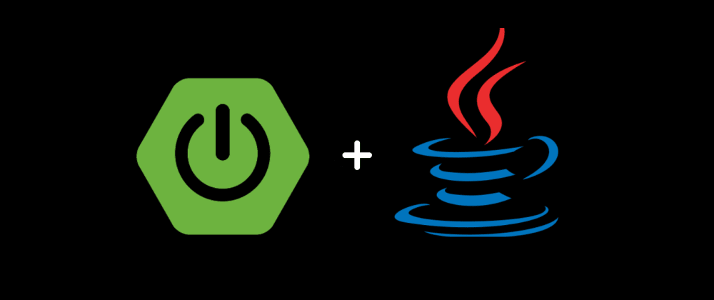

# Spring Playground

> Backend/Full stack projects built with Java spring boot framework

<p align="center"></p>


## Projects

- [Spring Shopping Cart](https://github.com/yennanliu/SpringPlayground/tree/main/ShoppingCart) - Full stack ecommerce service with Vue.js, Java Spring boot
- [Spotify PlayList](https://github.com/yennanliu/SpringPlayground/tree/main/springSpotifyPlayList) : App for song recommendation, playList, album.. management
- [Spring Employee System](https://github.com/yennanliu/SpringPlayground/tree/main/springEmployeeSystem) - Full stack Employee System with Vue.js, Java Spring boot
- [Spring Data platform](https://github.com/yennanliu/SpringPlayground/tree/main/SpringDataPlatform) - Full stack Flink data platform with Vue.js, Java Spring boot
- [WareHouse system](https://github.com/yennanliu/SpringPlayground/tree/main/springWarehouse): WareHouse management tool
- [Blog system](https://github.com/yennanliu/SpringPlayground/tree/main/springBootBlog) : Blog system
- [ChatRoom](https://github.com/yennanliu/SpringPlayground/tree/main/springChatRoom) : Chat room service with webSocket
- [springBasics](https://github.com/yennanliu/SpringPlayground/tree/main/projects_basic) : Basic Spring project demo


## Structure

<details>
<summary>Structure</summary>

```
# https://www.linkedin.com/posts/eczachly_softwareengineering-activity-6891156612426317824-iBfm

1. DAO (aka data access objects)
These files manage the connection with your database. They manage the CRUD operations.

2. Routes
These files manage HTTP and the networking layer of your server. The only logic here should be, request, response, and error handling of requests and responses.

3. Services
These files encapsulate the business logic of your application so you can use them in other areas of your application.

4. Middlewares
Middlewares usually sit in front of your API's routes. They do things like, logging, rate-limiting, etc. They are really critical to include for building a resilient, secure API.

5. Components
Components are pieces of the frontend that you want to reuse in multiple places. Imagine you built a fancy form component that you want to share among multiple pages.

6. Pages
Pages are the last piece of the puzzle and they're essentially other frontend components that are an amalgamation of components and services.
```

</details>


## POJO、PO、DTO、VO、BO

<details>
<summary>POJO、PO、DTO、VO、BO</summary>

- POJO (Plain Old Java Object)
	- 簡單並且純粹，POJO就是一個Java物件只包含自己的屬性(private)和提取或儲存這些屬性的method(get、set)，而其他的Object也是以POJO為基準開始延伸。

- PO (persistent object)
	- 因為ORM框架的誕生所以才有PO的概念，可以簡單地將它視為資料庫table對應的java物件，通常PO的名詞都會與使用hibernate相關

- DTO (Data Transfer Object)
	- 傳輸用的物件，假設今天我的程式像資料庫提取了PO資料物件，我必須將我的資料傳往其他系統或是服務時則可以用DTO進行再包裝，通常DTO的資訊都會比PO少，因為沒有必要將全部的資料傳輸出去。

- VO (value object)
	- 用於呈現時的資料包裝，並且將實體的資料(PO)抽象適合當前程式運作的物件，他可以很單純如同PO一樣對應資料庫的屬性，但他也可以包含多個PO組裝成一個較為複雜的資料物件。
	- 接收前端傳遞來的數據
	- 將後端處理完的數據, 封裝成前端需要的形式

- DAO (data access object)
	- 用於ORM(hibernate)將資料從資料庫提取的邏輯物件，其中邏輯主要包含如何提取資料庫的資料(SQL)並且將資料包裝成PO。

- BO (business object)
	- 用於業務層開發的物件，和PO和VO差別在於BO包含複雜的業務邏輯，而不再是單純的資料存取或儲存物件。

Ref
	- https://hackmd.io/@MonsterLee/HJyAdgRBB#:~:text=DTO%20(Data%20Transfer%20Object)&text=%E5%82%B3%E8%BC%B8%E7%94%A8%E7%9A%84%E7%89%A9%E4%BB%B6%EF%BC%8C%E5%81%87%E8%A8%AD,%E5%85%A8%E9%83%A8%E7%9A%84%E8%B3%87%E6%96%99%E5%82%B3%E8%BC%B8%E5%87%BA%E5%8E%BB%E3%80%82
	- https://youtu.be/L1hCZ9AumP0?t=485

<p align="center"></p>


</details>


## Ref

<details>
<summary>Ref</summary>

- Init
	- [Spring Boot Initializr](https://start.spring.io/)
- Projects
- [BE roadmap](https://roadmap.sh/backend)

</details>
