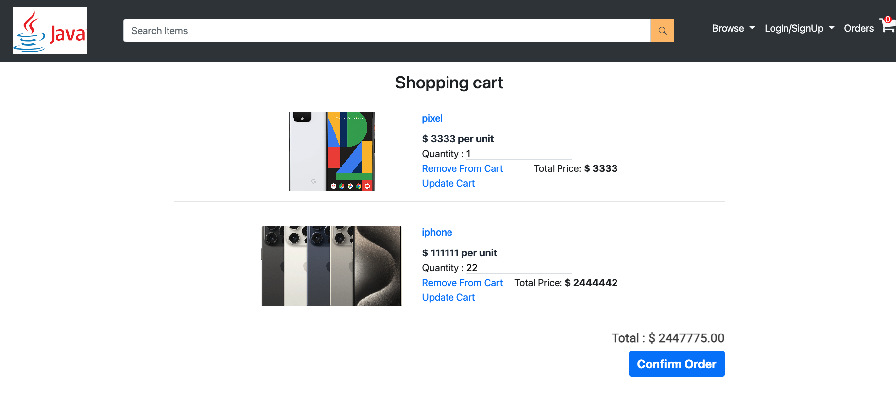
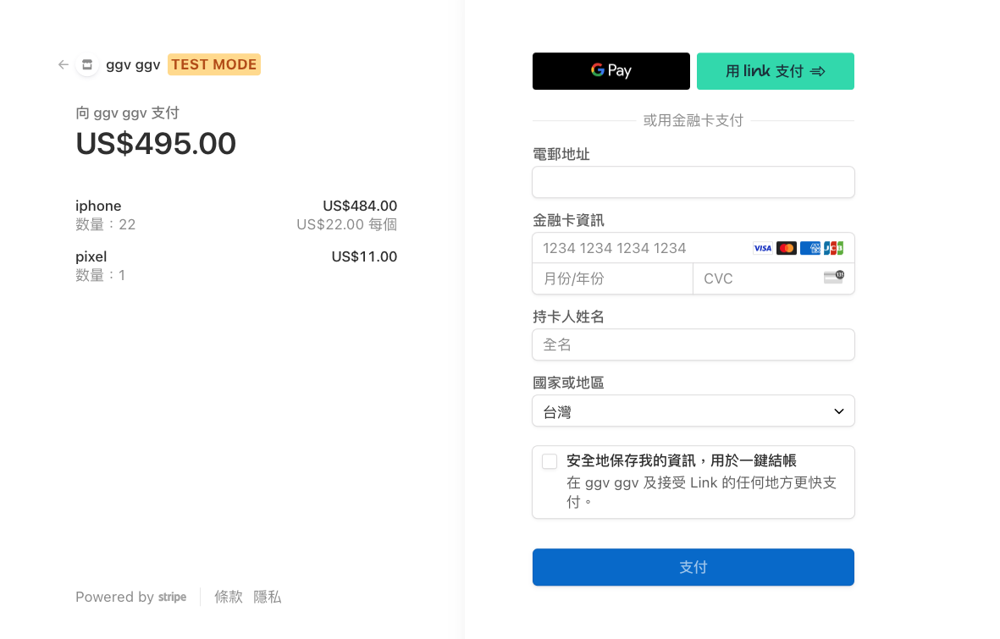
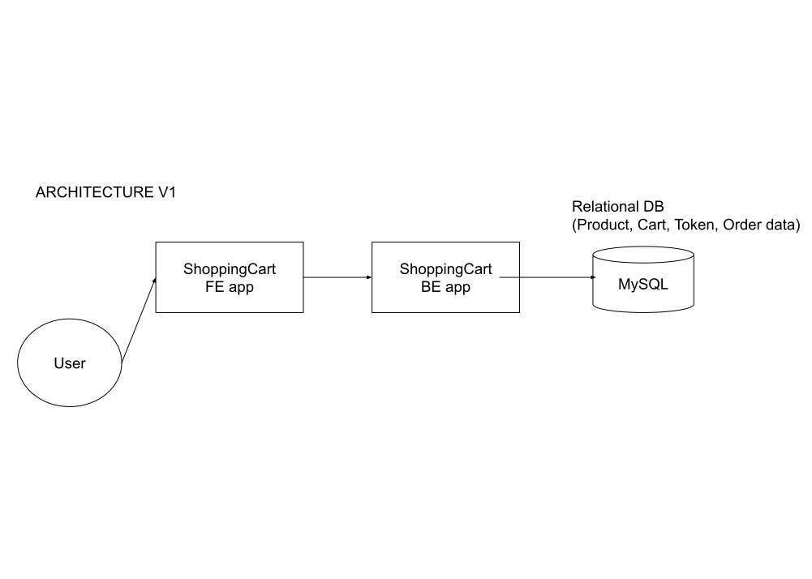
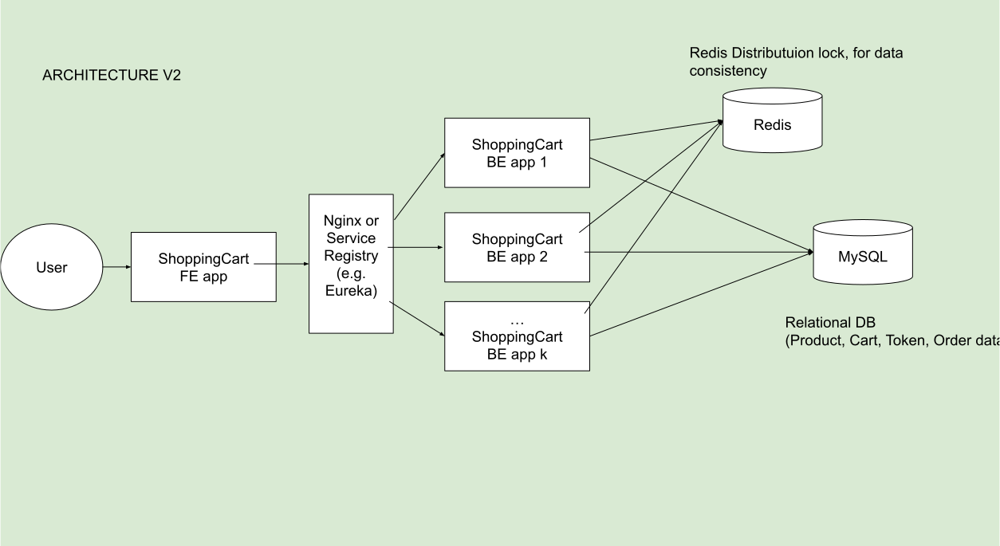

# Shopping Cart
> Full stack E-commerce system built with Vue.js, Spring boot

- [Blog Intro](https://yennj12.js.org/yennj12_blog_V4/posts/spring-boot-ecommerce-shopping-cart-stripe-integration/)

- Frontend : Vue
- Backend : Spring boot

<p align="center"></p>

<p align="center"></p>

<p align="center"></p>


ARCHITECTURE :

- V1
<p align="center"></p>


- V2
<p align="center"></p>

## Main functions:

- Login, logout
- Authorization with Token
- Product, category, cart CRUD
- Stripe payment gateway integration

## Dependency

- Java 17+ (Spring Boot 3.2; Java 21 required to enable Virtual Threads)
- Vue.js
- npm
- maven
- MySQL 5.7+
- Redis 7+ (caching + distributed lock)


## Steps

- Create an account in Stripe (BE checkout)
	- https://dashboard.stripe.com/register?redirect=%2Fdocs%2Fjs%2Finitializing

- Stripe API ref
	- https://stripe.com/docs/api?lang=node

## Run (manually)

<details>
<summary>App</summary>

```bash
#---------------------------
# Run BE app
#---------------------------

# build
cd ShoppingCart/Backend
mvn package

# run
java -jar target/ShoppingCart-0.0.1-SNAPSHOT.jar

# BE endpoint : http://localhost:9999

#---------------------------
# Run FE app
#---------------------------

cd ShoppingCart/Frondend/ecommerce-ui
npm run serve

# FE endpoint : http://localhost:8080
```

</details>


## Run (docker)

<details>
<summary>Single instance (dev)</summary>

```bash
docker-compose up
```

</details>

<details>
<summary>High-availability (multi-instance + Nginx)</summary>

```bash
# Run 2 app replicas behind Nginx on port 80
docker-compose -f docker-compose-ha.yml up --scale app=2

# Health check
curl http://localhost/actuator/health
```

</details>


## High-Concurrency Enhancements

The service has been hardened for high-concurrency (C10K) workloads across six layered
approaches. Each one removes the ceiling exposed by the previous.

| # | Approach | Where | Key files |
|---|---|---|---|
| 1 | HikariCP pool tuning | `application.properties` | pool-size=50, connection-timeout=3s |
| 2 | JDK 21 Virtual Threads | `application.properties` (commented) | `spring.threads.virtual.enabled=true` — enable on JDK 21 |
| 3 | Redis caching | `RedisConfig.java`, service `@Cacheable` | tokens 15 min, products 5 min, categories 30 min |
| 4 | Distributed lock (Redisson) | `CartService`, `OrderService` | `cart:user:<id>`, `order:user:<id>` lock keys |
| 5 | Horizontal scaling + Nginx | `docker-compose-ha.yml`, `nginx/nginx.conf` | `least_conn` upstream, actuator health probe |
| 6 | Read replica routing | `DataSourceConfig.java` | `@Transactional(readOnly=true)` → replica; enable with `app.datasource.replica.enabled=true` |

**Full engineering deep-dive**: [`doc/high_concurrency_engineering.md`](doc/high_concurrency_engineering.md)

Covers: why each approach is ordered the way it is, failure modes, JDBC pool math,
deserialization security (RCE risk of `LaissezFaireSubTypeValidator`), Redlock lease-time
vs. watchdog, replication lag trade-offs, and what was intentionally omitted.

### Quick-start: enable Virtual Threads (requires JDK 21)

```properties
# application.properties
spring.threads.virtual.enabled=true
```

```xml
<!-- pom.xml -->
<java.version>21</java.version>
```

### Quick-start: enable Read Replica

```properties
# application.properties
app.datasource.replica.enabled=true
app.datasource.primary.url=jdbc:mysql://primary-host:3306/shopping_cart
app.datasource.primary.username=root
app.datasource.primary.password=
app.datasource.primary.driver-class-name=com.mysql.cj.jdbc.Driver
app.datasource.replica.url=jdbc:mysql://replica-host:3306/shopping_cart
app.datasource.replica.username=root
app.datasource.replica.password=
app.datasource.replica.driver-class-name=com.mysql.cj.jdbc.Driver
```

## API

| API | Type | Purpose |
| ----- | -------- | ---- |
| http://localhost:8080 | UI home page (FE) | |
| http://localhost:9999/swagger-ui/index.html | Swagger UI (BE) | |
| http://localhost:9999/actuator/health | Health check | Load balancer probe |

## TODO

- Implement cart with web session (not need to login)
- Signup with Google OAuth 2
- Flash-sale inventory locking (`product:stock:<id>`) with optimistic concurrency
- Redis Sentinel / Cluster for HA Redis
- Async order confirmation email (Spring `@Async` → RabbitMQ)
