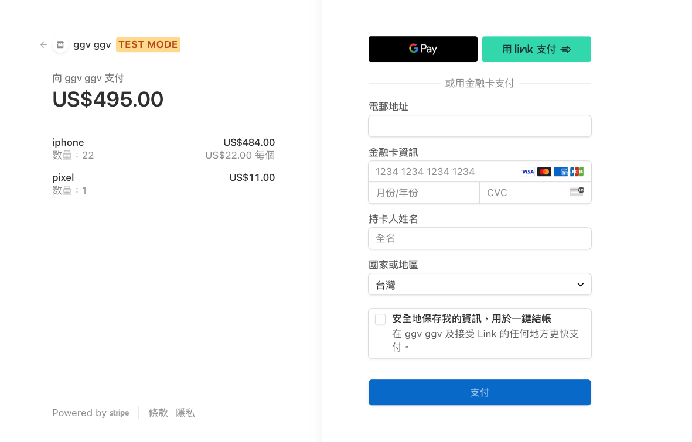
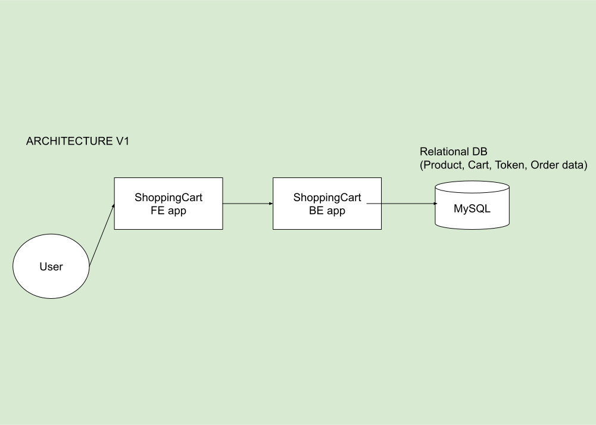

# Shopping Cart
> Full stack E-commerce system built with Vue.js, Spring boot

- Frontend : Vue
- Backend : Spring boot

<p align="center"></p>

<p align="center"></p>

<p align="center"></p>


ARCHITECTURE :

- V1
<p align="center"></p>


- V2
<p align="center"></p>

## Main functions:

- Login, logout
- Authorization with Token
- Product, category, cart CRUD
- Stripe payment gateway integration

## Dependency

- Java 11 (for using Stripe API properly)
- Vue.js
- npm
- maven
- Mysql


## Steps

- Create an account in Stripe (BE checkout)
	- https://dashboard.stripe.com/register?redirect=%2Fdocs%2Fjs%2Finitializing

- Stripe API ref
	- https://stripe.com/docs/api?lang=node

## Run

<details>
<summary>App</summary>

```bash
#---------------------------
# Run BE app
#---------------------------

# build
cd ShoppingCart/Backend
mvn package

# run
java -jar target/ShoppingCart-0.0.1-SNAPSHOT.jar

# BE endpoint : http://localhost:9999

#---------------------------
# Run FE app
#---------------------------

cd ShoppingCart/Frondend/ecommerce-ui
npm run serve

# FE endpoint : http://localhost:8080
```

</details>

## API

| API | Type | Purpose | Example cmd | Comment|
| ----- | -------- | ---- | ----- | ---- |
| http://localhost:8080| UI home page (FE) | | |
| http://localhost:9999/swagger-ui.html | API page (BE) | | |


## Important Concepts
