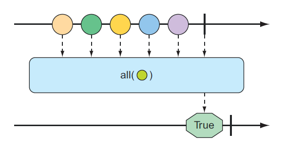

# 10.3.4 对反应类型执行逻辑操作

有时你只需要知道 Mono 或 Flux 发布的条目是否符合某些条件。all\(\) 和 any\(\) 操作将执行这样的逻辑。图 10.21 和 10.22 说明了 all\(\) 和 any\(\) 是如何工作的：




假设你想知道由 Flux 发布的每个 String 都包含字母 _a_ 或字母 _k_。下面的测试演示如何使用 all\(\) 检查该条件：

```java
@Test
public void all() {
    Flux<String> animalFlux = Flux.just(
        "aardvark", "elephant", "koala", "eagle", "kangaroo");
    
    Mono<Boolean> hasAMono = animalFlux.all(a -> a.contains("a"));
    StepVerifier.create(hasAMono)
        .expectNext(true)
        .verifyComplete();
    
    Mono<Boolean> hasKMono = animalFlux.all(a -> a.contains("k"));
    StepVerifier.create(hasKMono)
        .expectNext(false)
        .verifyComplete();
}
```

在第一个 StepVerifier 中，检查字母 _a_。all 操作应用于源 Flux，从而生成 Boolean 类型的 Mono。在本例中，所有的动物名都包含字母 _a_，因此从产生的 Mono 发出 true。但是在第二个 StepVerifier 中，得到的 Mono 将发出 false，因为并非所有的动物名都包含 k。

与其执行全部满足或完全不满足的检查，不如满足至少有一个条目匹配。在这种情况下，any\(\) 操作就是你所需要的。这个新的测试用例使用 any\(\) 检查字母 _t_ 和 _z_：

```java
@Test
public void any() {
    Flux<String> animalFlux = Flux.just(
        "aardvark", "elephant", "koala", "eagle", "kangaroo");
    
    Mono<Boolean> hasAMono = animalFlux.any(a -> a.contains("t"));
    StepVerifier.create(hasAMono)
        .expectNext(true)
        .verifyComplete();
    
    Mono<Boolean> hasZMono = animalFlux.any(a -> a.contains("z"));
    StepVerifier.create(hasZMono)
        .expectNext(false)
        .verifyComplete();
}
```

在第一个 StepVerifier 中，你会看到生成的 Mono 发出 true，因为至少有一个动物名有字母 _t_（特别是 _elephant_）。在第二个 StepVerifier 中，生成的 Mono 发出 false，因为没有一个动物名包含 _z_。

