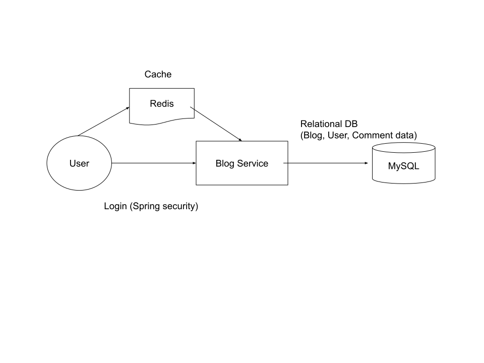

# Spring Blog

<p align="center"></p>

Build a blog system via spring boot. Functionality : CRUD, Login/Logout (Spring security, OAuth), Blog post, edit, Comment, New user register, edit, Blog search


## Technology

- Java 11 (JDK 11)
- Mybatis, Data Jpa, lombok
- Spring security, OAuth
- Mysql

### Login:

- Account : admin
- Pwd : 123

- Account : user1
- Pwd : 123

## Run (local)

<details>
<summary>App</summary>

```bash

#---------------------------
# Mysql (optional)
#---------------------------

# Mysql
Mysql DB : blog_db
DDL : /sql

#---------------------------
# Run app
#---------------------------

# build
mvn package

# run
java -jar <built_jar>
```
</details>

## Run (Ubuntu)

<details>
<summary>App</summary>

```bash

#---------------------------
# Step 1) clone code
#---------------------------

git clone https://github.com/yennanliu/SpringPlayground.git
cd SpringPlayground/springBlog

# update apt
sudo sudo apt update

#---------------------------
# Step 2) build jar
#---------------------------

# build java jar
sudo apt install maven
mvn package -DskipTests

#---------------------------
# Step 3) install mysql server, update pwd, data model
#---------------------------

sudo apt install mysql-server

# start mysql @ ububtu
sudo service mysql start

# access mysql CLI
# https://www.twblogs.net/a/5baa9f262b7177781a0e54cb
sudo mysql -u root # I had to use "sudo" since is new installation

mysql> USE mysql;
mysql> UPDATE user SET plugin='mysql_native_password' WHERE User='root';
mysql> FLUSH PRIVILEGES;
mysql> exit;

sudo service mysql restart

# access mysql CLI again, and run DDL under `/sql`
mysql -u root

#---------------------------
# Step 2) run App
#---------------------------
# copy jar
scp -i Downloads/yen-personal-aws-key-1.pem SpringPlayground/springBootBlog/target/md-blog-0.0.1-SNAPSHOT.jar  ubuntu@xx-yyy-zzz.ap-northeast-1.compute.amazonaws.com:/home/ubuntu

nohup java -jar target/mdblog-0.0.1-SNAPSHOT.jar &
```

</details>


## API

| API      | Type | Purpose                         | Example cmd                                            | Comment                        |
|----------|------|---------------------------------|--------------------------------------------------------|--------------------------------|
| `GET`  | GET  | all posts                       | http://localhost:8888/posts/all                        | home page                      |
| `GET`  | GET  | all posts (with page)           | http://localhost:8888/posts/all?pageNum=1              | home page (with page)          |
| `GET`  | GET  | homepage  (with page, pageSize) | http://localhost:8888/posts/all?pageNum=0&pageSize=100 | home page (with page, size)    |
| `GET`  | GET  | login                           | http://localhost:8888/login                            | login (accout:admin, pwd: 123) |
| `POST` | POST | new post                        | http://localhost:8888/posts/create                     | create new post                |
| `GET`  | POST | edit post                       | http://localhost:8888/posts/edit/pre_edit              | edit post                      |
| `GET`  | GET  | show/edit author                | http://localhost:8888/author/all                       | show/edit author               |
| `GET`  | GET  | logout                          | http://localhost:8888/logout                           | logout                         |

| API | Type | Purpose | Example cmd | Comment|
| ----- | -------- | ---- | ----- | ---- |
| `GET /` | GET |Swagger | 	http://localhost:8888/swagger-ui.html |Api page|


## TODO

- UI improvement
  - FE layout when access via mobile
- Admin page
  - edit user profile, update photo
- Notification email
- Post tag
- Post timeline
- Fix bugs
  - logout, login again, redirect to wrong pages
- FE App (Blog service V2)
- 404, 500 ... html, custom error msg