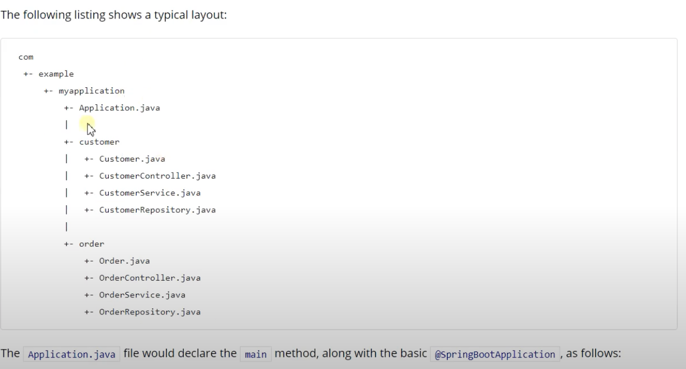

# springBootPOC1
> Spring Boot POC project

## Quick Start

```bash
#---------------------
# Maven
#---------------------

#---------------------
# intellJ
#---------------------
```

### API

| API | Type | Purpose | Example cmd | Comment|
| ----- | -------- | ---- | ----- | ---- |
| `GET /hello` | GET | test endpoint |http://localhost:8888/hello ||
| `GET /hello` | GET | test endpoint |http://localhost:8888/hello2?name=<name> ||
| `GET /world` | GET | test endpoint |http://localhost:8888/world ||
| `GET /car` | GET | test endpoint |http://localhost:8888/car ||

## Important Concepts

- `spring-boot-starter-xxx-yyy` : quick starter that wraps and auto installs all depdency for a specigic dev scenario
	- https://www.javatpoint.com/spring-boot-starters
	- we can also create our own "starter"
- Location the Main Application class
	- files in main app's package or in main app's sub package CAN be scanned (visible to) by main app
	- if we really want app can scan files outside scope above, we can add below annotation to main app
		- `@SpringBootApplication` or `@ComponentScan`
	<p align="center"></p>
	- https://docs.spring.io/spring-boot/docs/current/reference/html/getting-started.html#getting-started.system-requirements
- Config binding
	- https://www.yuque.com/atguigu/springboot/qb7hy2
	- method 1)
		- `@Component + @ConfigurationProperties`
	- method 2)
		- `@EnableConfigurationProperties + @ConfigurationProperties`
			- for 3rd party lib
	- method 3)
		- `@Component + @ConfigurationProperties`
- Auto config
	- https://youtu.be/lDzXRsOODXA?t=1708
	- Spring Boot auto import all auto config class : `xxxAutoConfiguration`
	- Every auto config class is enabled with conditions
		- default : get value from config
		- from `xxxProperties`, binding with it
	- Enabled cofig class will be added to container
	- Once above happen, container then has those functionality
	- Custom setting
		- users replace underline components via their own `"@Bean"`
		- users change setting via config file (e.g. `xxxProperties`)
	- `xxxAutoConfiguration` -> component -> `xxxProperties` get value -> application.properties

## Ref

- Init Spring boot project
	- https://www.youtube.com/watch?v=RreK80HHAAk&list=PLmOn9nNkQxJFKh2PMfWbGT7RVuMowsx-u&index=19
	- https://start.spring.io/
- Course
	- Video
		- https://www.youtube.com/watch?v=xu33IJNxkn0&list=PLmOn9nNkQxJFKh2PMfWbGT7RVuMowsx-u
	- Doc material
		- https://www.yuque.com/atguigu/springboot/?fbclid=IwAR3FhDeXH7A73kH8PubSWgkVLmwmsCwR9nFKCn2dp0KalBY6mpBCnZ2eQxs
	- Source code
		- origin
			- https://gitee.com/leifengyang/springboot2
		- mirror
			- https://github.com/yennanliu/springPlayground/tree/main/springboot2Course
- Project generator
	- https://start.spring.io/