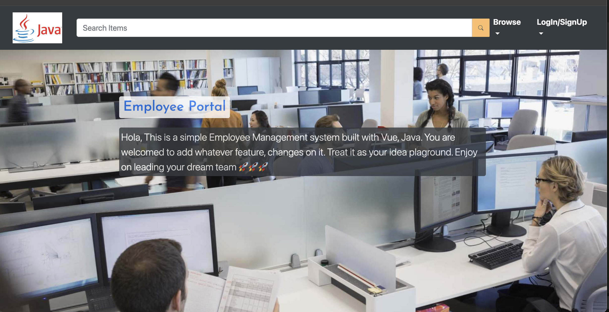
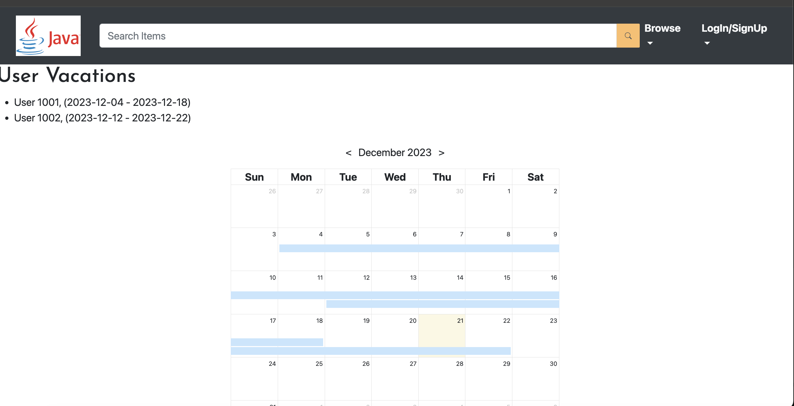
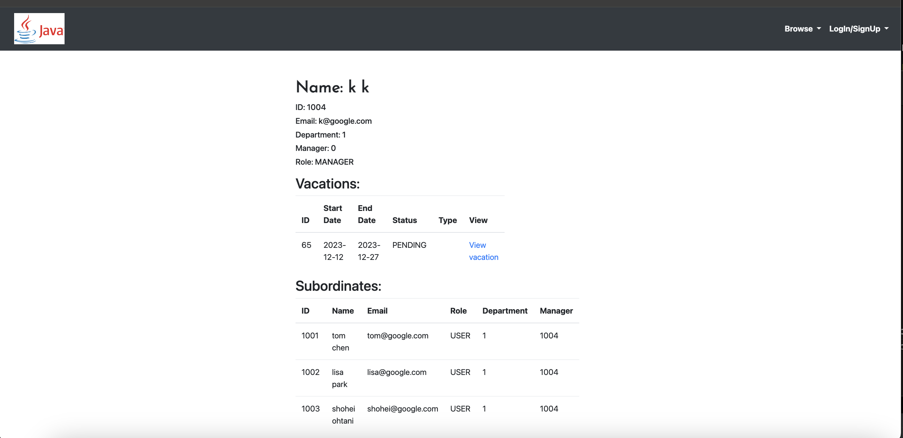
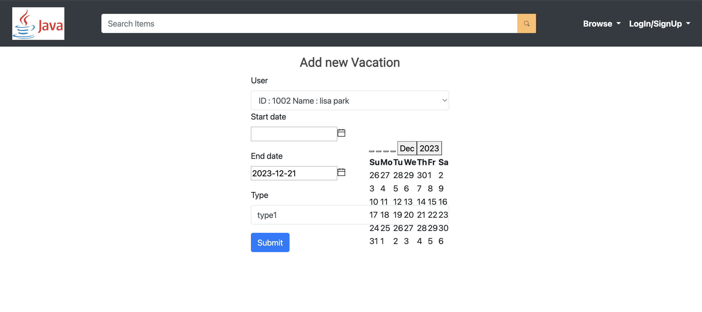
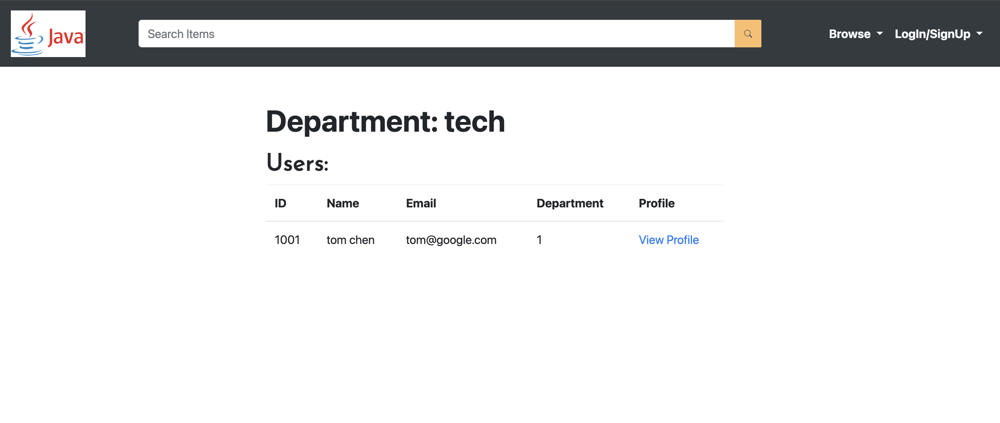
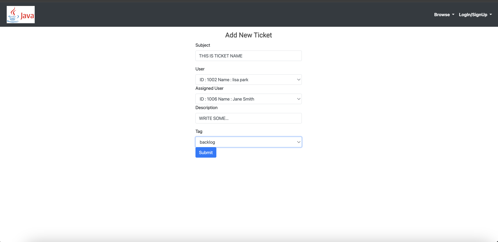

# SpringEmployeeSystem
> Build full stack Employee management system with Vue, Java

- Frontend : Vue
- Backend : Spring boot

<p align="center"></p>

<p align="center"></p>

<p align="center"></p>

<p align="center"></p>

<p align="center"></p>

<p align="center"></p>

## Steps


## Run (manually)

<details>
<summary>App</summary>

```bash
#---------------------------
# Run BE app
#---------------------------

# build
mvn package

# run
java -jar target/springEmployeeSystem-0.0.1-SNAPSHOT.jar
```

```bash
#---------------------------
# Run FE app
#---------------------------

cd springEmployeeSystem/frontend/employee-system-ui

npm run serve
```

</details>


## Run (Docker)

<details>
<summary>App</summary>

```bash
docker-compose up
```

</details>

## API

| API | Type | Purpose | Example cmd | Comment|
| ----- | -------- | ---- | ----- | ---- |
| http://localhost:8080/ |  FE App | | |
| http://localhost:9998/swagger-ui.html |  BE API | | |


## Important Concepts

## Ref

- Course
    - Video
        - Fake SMTP turtorial (mailtrap)
            - https://youtu.be/kpKUMmAmcj0?si=nerpvQP-35bLdoeK&t=777


## TODO:

1. Payroll service
2. schema endpoint (done)
3. msg service (user <-> sys admin)
4. ticket service (done)
5. oncall/schedule service
    - [ref](https://developers.google.com/optimization/scheduling/employee_scheduling?hl=zh-tw&fbclid=IwAR3pPBfOG6MXgRinsq8s7SK7UNOH4Va6bKDY6dyakpUy1TBtlpz9WYe7ujg#assi)
6. checkin/checkout service
7. review service
8. bug fix
9. unix test, integraton test
10. CICD