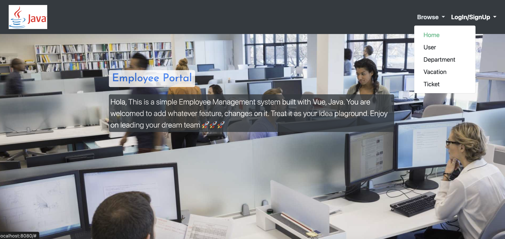

# SpringEmployeeSystem
> Build full stack Employee management system with Vue, Java

- Frontend : Vue
- Backend : Spring boot

<p align="center"></p>

<p align="center"></p>

<p align="center"></p>

<p align="center"></p>

<p align="center"></p>

## Steps


## Run

<details>
<summary>App</summary>

```bash
#---------------------------
# Run BE app
#---------------------------

# build
mvn package

# run
java -jar target/springEmployeeSystem-0.0.1-SNAPSHOT.jar
```

```bash
#---------------------------
# Run FE app
#---------------------------

cd springEmployeeSystem/frontend/employee-system-ui

npm run serve
```

</details>

## API

| API | Type | Purpose | Example cmd | Comment|
| ----- | -------- | ---- | ----- | ---- |
| http://localhost:8080/ |  FE App | | |
| http://localhost:9998/swagger-ui.html |  BE API | | |

## Important Concepts

## Ref

- Course
    - Video
        - xxx
