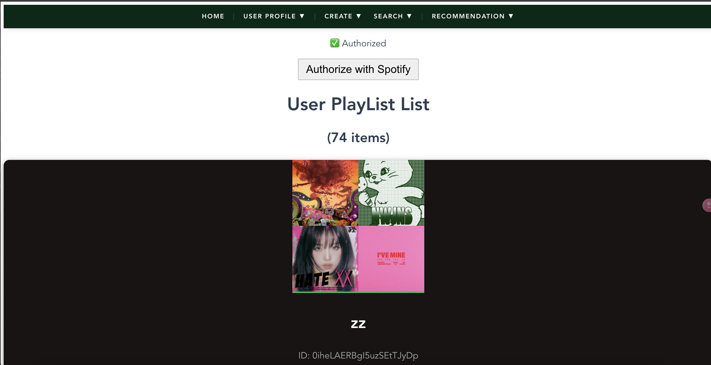
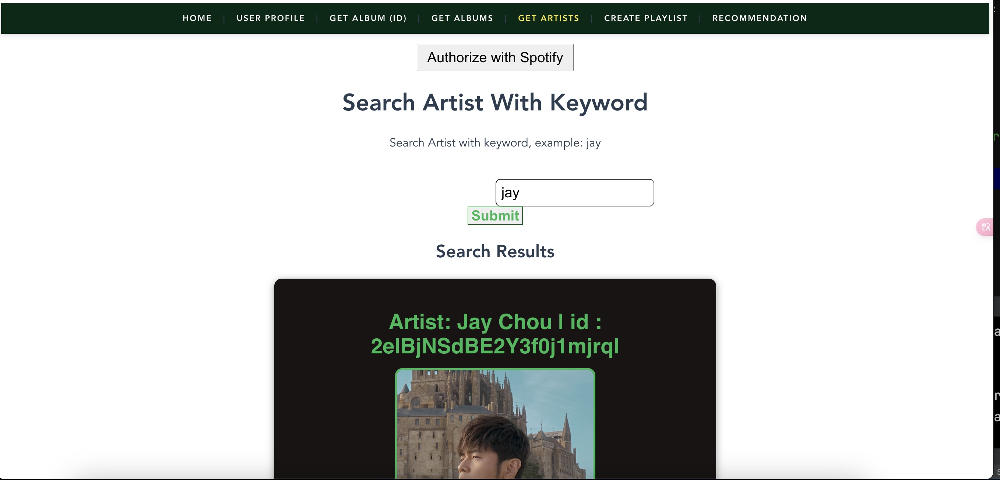

# Spotify PlayList

<p align="center"></p>

<p align="center"></p>

<p align="center"></p>

<p align="center"></p>

<p align="center"></p>

## Motivations

- Why

Spotify continues to recommend similar songs, there is no way that users can "actively" ask Spotify to generate new song playList

- How

Build this e2e app, so can offer above feature via API leverage.


- What

A full stack app (FE + BE) Spotify app. Features as below:
1. Song recommendation based on ML and input values
2. Artist/Song query : show artist/Song spotify data
3. Album query : songs preview, show spotigy Album data
4. Spotify API auth:
	- OAuth with Spotify API platform, so can access Spotify API with received token
	- Renew received token, so can keep using API without OAuth again
	- Redirect when OAuth success

- Backend : Java
- Frontend : Vue

## Run

<details>
<summary>Run</summary>

### Prerequisite

- Step 1. Register developer account at [Spotify API platform](https://developer.spotify.com/documentation/web-api)
- Step 2. Setup Spotify Api key
	- Update `spotify.clientSecret`, `spotify.clientId` at [application.properties](https://github.com/yennanliu/SpringPlayground/blob/main/springSpotifyPlayList/backend/SpotifyPlayList/src/main/resources/application.properties#L5)
- Step 3. update Auth Redirect URL at [Spotify API platform](https://developer.spotify.com/documentation/web-api)
- Step 4. update `baseURL` at FE app : [App.vue](https://github.com/yennanliu/SpringPlayground/blob/main/springSpotifyPlayList/frontend/spotify-playlist-ui/src/App.vue#L33)
- Step 5. update `spotify.redirectURL` at BE app (same as the one setup as step 3):
[application.properties](https://github.com/yennanliu/SpringPlayground/blob/main/springSpotifyPlayList/backend/SpotifyPlayList/src/main/resources/application.properties#L6)

### Run (Docker)
```bash

# export env var
# docker-compose

# local
export SPOTIFY_CLIENT_SECRET=<your_new_client_secret>
export SPOTIFY_REDIRECT_URL=http://<server_ip>:8080/playlist

# FE
export VUE_APP_BASE_URL=http://localhost:8888/

docker-compose up
```

### Run (manually)
```bash

#------------------------
# BE
#------------------------
# build
cd springSpotifyPlayList/backend/SpotifyPlayList
mvn package

# run
java -jar target/springSpotifyPlayList-0.0.1-SNAPSHOT.jar


#------------------------
# FE
#------------------------
cd /springSpotifyPlayList/frontend/spotify-playlist-ui
npm run serve
```

### Docker cmd
```bash
#------------------------
# CLEAN DOCKER DATA
#------------------------
docker rm -f $(docker ps -aq)
# Remove all images
docker rmi -f $(docker images -q)
# remove all containers in docker
docker rm -f $(docker ps -a -q)
# remove all images in docker
docker rmi -f $(docker images -q -a)


# remove all docker data
docker system prune

#------------------------
# DOCKER LOGS
#------------------------
# check docker logs

docker logs <container_id>
```

</details>

## Architecture


## API

| API | Type | Purpose | Example cmd | Comment|
| ----- | -------- | ---- | ----- | ---- |
| http://localhost:8888/swagger-ui.html |  BE API | | |
| http://localhost:8080 |  FE App UI | | |


## Important Concepts

## Reference

<details>
<summary>Reference</summary>

- Java client
	- https://github.com/spotify-web-api-java/spotify-web-api-java
- Doc
	- https://spotify-web-api-java.github.io/spotify-web-api-java/

- Libaray
	- https://github.com/spotify-web-api-java/spotify-web-api-java
	- Recommendation
		- https://github.com/spotify-web-api-java/spotify-web-api-java/blob/76d69b152cb17e7b8d7ea56b58f0a9b078774708/examples/data/browse/GetRecommendationsExample.java#L5
		- https://spotify-web-api-java.github.io/spotify-web-api-java/se/michaelthelin/spotify/model_objects/specification/Recommendations.html

- Recommendations API
	- https://developer.spotify.com/documentation/web-api/reference/get-recommendations

- get song feature
	- https://developer.spotify.com/documentation/web-api/reference/get-audio-features

- Code example
	- https://jitpack.io/p/lbengzon/spotify-web-api-java
	- https://github.com/yennanliu/nelson/blob/master/server.js#L88

- Other project
	- https://nelson.glitch.me/#
	- https://github.com/hardikSinghBehl/spotifyApiSpring/tree/master


- ML ref notebook
	- https://github.com/yennanliu/SpringPlayground/blob/main/springSpotifyPlayList/doc/Spotify_ApI_call_demo.ipynb?fbclid=IwAR1ZhL081euAUCeB54kaMMNqCHBN1HnuLLTYpnpjNHAf4MMFW8VkgdP5N1o
	- https://medium.com/@shruti.somankar/building-a-music-recommendation-system-using-spotify-api-and-python-f7418a21fa41


</details>


## TODO

<details>
<summary>TODO</summary>

1. code refactor
	- dep injection : `spotifyApi`
2. integrate with chatGPT
3. CICD
4. UI redesign
5. prepare config for ec2 deployment
	- FE:
		- BASE_URL
	- BE:
	 	- redirect_url
6. fix FE auth_url
</details>