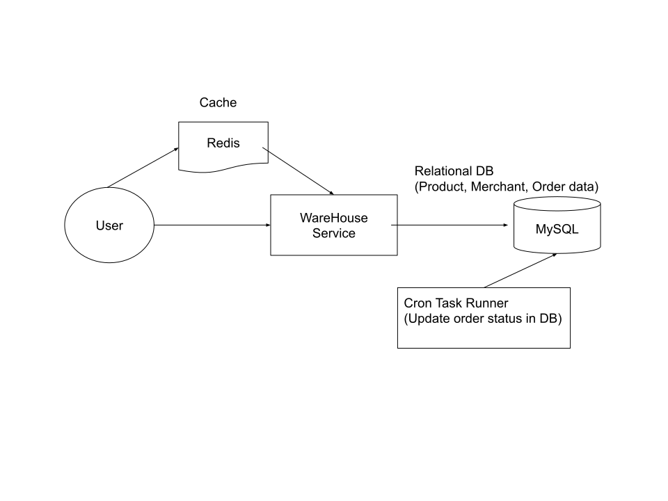
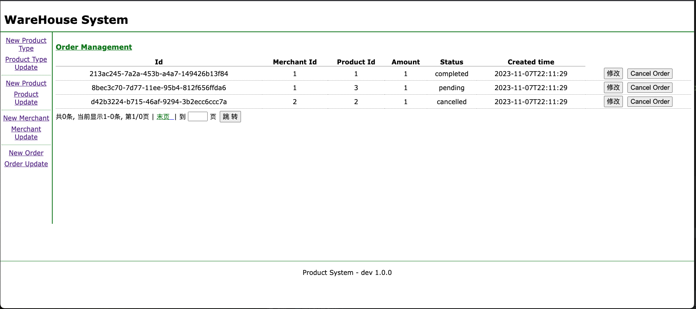
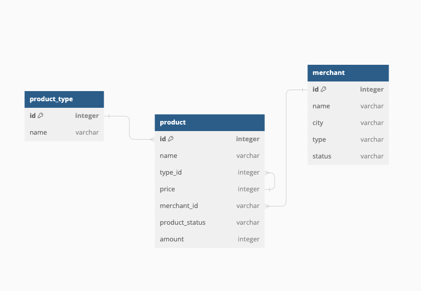

# Spring Warehouse System

<p align="center"></p>

<p align="center"></p>


Build a Warehouse admin system with Spring boot.
This system is for internal operation users. offers product, merchant, and order management. Warehouse data are maintained, managed via this app

[Demo](http://43.206.107.101:7777/)

## Technology
- Java 8
- Spring boot
- mybatispluss
- thymeleaf
- Mysql

## Data Model

<details>
<summary>Data Model</summary>

<p align="center"></p>

</details>

- Main functionality
  - Add, remove, modify on *product* (storage), type, merchant, order

- Terms
  - Product : goods storage in warehouse
  - Merchant : business (company) who owns product
  - Orders : a transaction, product from warehouse will be sent to client 


## Run (local)

<details>
<summary>App</summary>

- Run DDL first
	- all SQL files under `/sql/ddl`

```bash
#---------------------------
# Run app
#---------------------------

# build
mvn package

# run
java -jar target/springWarehouse-0.0.1-SNAPSHOT.jar
```

</details>


## Run (Docker)

<details>
<summary>App</summary>

```bash
git clone https://github.com/yennanliu/SpringPlayground.git
cd SpringPlayground/springWarehouse
docker build -t spring-warehouse .
docker run -p 7777:7777 spring-warehouse
```

</details>

## Run (Ubuntu)

<details>
<summary>App</summary>

```bash

#---------------------------
# Step 1) clone code
#---------------------------

git clone https://github.com/yennanliu/SpringPlayground.git
cd SpringPlayground/springWarehouse

# update apt
sudo sudo apt update

#---------------------------
# Step 2) build jar
#---------------------------

# build java jar
sudo apt install maven
mvn package -DskipTests

#---------------------------
# Step 3) install mysql server, update pwd, data model
#---------------------------

sudo apt install mysql-server

# start mysql @ ububtu
sudo service mysql start

# access mysql CLI
# https://www.twblogs.net/a/5baa9f262b7177781a0e54cb
sudo mysql -u root # I had to use "sudo" since is new installation

mysql> USE mysql;
mysql> UPDATE user SET plugin='mysql_native_password' WHERE User='root';
mysql> FLUSH PRIVILEGES;
mysql> exit;

sudo service mysql restart

# access mysql CLI again, and run DDL under `/sql/ddl`
mysql -u root

#---------------------------
# Step 2) run App
#---------------------------
nohup java -jar target/springWarehouse-0.0.1-SNAPSHOT.jar &
```

</details>

## API

| API | Type | Purpose | Example cmd | Comment|
| ----- | -------- | ---- | ----- | ---- |
| http://localhost:7777/ | Get | Home page || |
| http://localhost:7777/swagger-ui/index.html | Get | API doc page || |

## Important Concepts

## TODO

1. Add spec doc, feature design
2. Add module:
    - buying
    - storage
    - sales
    - report
    - resource management
    - system admin
3. Add amount to Product bean
4. Add batch add/delete
5. Code refactor
6. Unit test
7. SQL injection fix
8. Deployment
   1. DockerFile
   2. CI/CD
   3. logs
