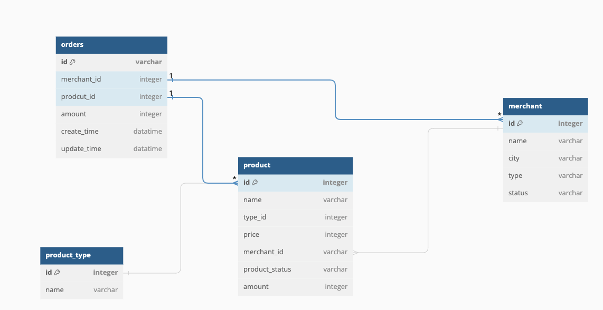

# Spring Warehouse System

Build a Warehouse admin system with Spring boot.
This system is for internal operation users. offers product, merchant, and order management.
Warehouse data are maintained, managed via this app

- Data Model
<p align="center"></p>

- Main functionality
  - Add, remove, modify on *product* (storage), type, merchant, order

- Terms
  - Product : goods storage in warehouse
  - Merchant : business (company) who owns product
  - Orders : a transaction, product from warehouse will be sent to client 

## Tech

- Java
- Spring boot
- mybatisplus
- thymeleaf
- Mysql


## Run

<details>
<summary>App</summary>

- Run DDL first
	- all SQL files under `/sql/ddl`

```bash
#---------------------------
# Run app
#---------------------------

# build
mvn package

# run
java -jar target/springWarehouse-0.0.1-SNAPSHOT.jar
```

</details>


## Run (Docker)

<details>
<summary>App</summary>

```bash
git clone https://github.com/yennanliu/SpringPlayground.git
cd SpringPlayground/springWarehouse
docker build -t spring-warehouse .
docker run -p 7777:7777 spring-warehouse
```

</details>

## API

| API | Type | Purpose | Example cmd | Comment|
| ----- | -------- | ---- | ----- | ---- |
| http://localhost:7777/ | Get | Home page || |
| http://localhost:7777/swagger-ui/index.html | Get | API doc page || |

## Important Concepts

## TODO

1. Add spec doc, feature design
2. Add module:
    - buying
    - storage
    - sales
    - report
    - resource management
    - system admin
3. Add amount to Product bean
4. Add batch add/delete
5. Code refactor
6. Unit test
7. Deployment
   1. DockerFile
   2. CI/CD
   3. logs
