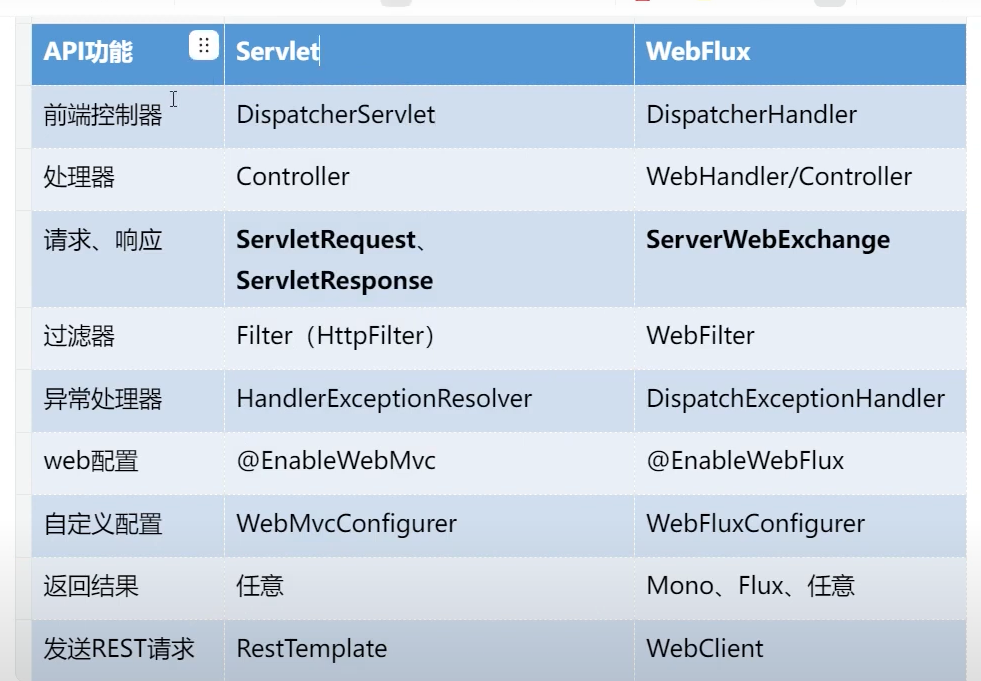
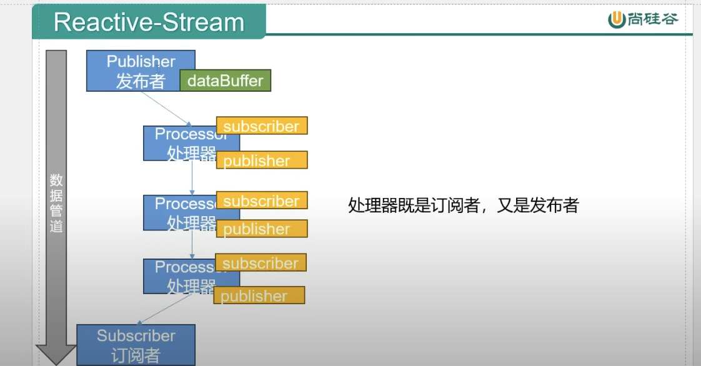
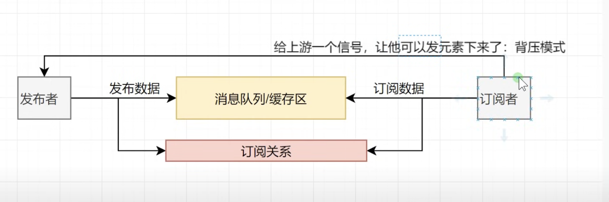
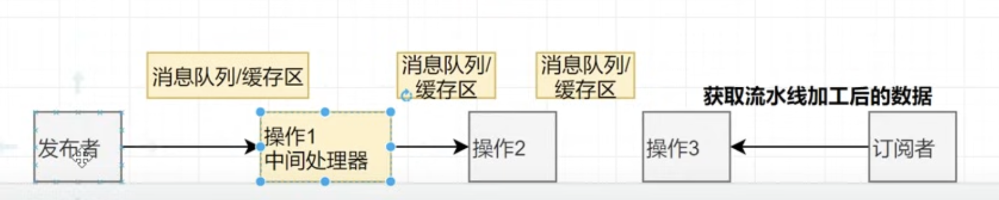

# webFluxPoc
> POC project with spring boot web flux (reactive java)

## Concept

<p></p>

- Lambda expression
  - https://youtu.be/H-ijsS-pfgQ?si=AO-ypUVuF78VLywy&t=194
  - https://github.com/yennanliu/SpringPlayground/blob/main/webFluxPoc/src/main/java/com/yen/webFluxPoc/dev/LambdaExample.java
  - `java.util.function`
    - consumer : 消費者
    - supplier : 生產者
    - predicate : 斷言 (accept val, return boolean)

- Lambda input, output Types
  - 1. has input param, no output param (`publisher` 消費者, 只消費, 不輸出) :`function.accept`
  - 2. has input param, has output param (多功能函數) : `function.apply`
  - 3. no input param, no output param (普通函數): `runnable`
  - 4. no input param, has output param (`supplier` 生產者): `supplier.get()`

- Reactive Streams
  - JVM module for handling stream use cases
  - handle infinite amount of elements
  - ordering
  - synchronous process element within modules
  - no blocking (back pressure 背壓)

  - <p align="center"></p>

  - summary
    - low level: buffer data model, event driven, async call back
    - coding : stream programming + chain operation + declarative API
    - affect: whole async, process event in real-time, high IO, less resources cost

- 觀察者模式
  - Subscriber : 訂閱者
  - publisher: 發布者
  - Subscription: 訂閱關係 (綁定發布者, 訂閱者)
  - https://youtu.be/_3oFXO7crcE?si=NhVFpNJp1K6BFJ7e&t=154
  <p></p>

  - intermedia operator : 中間操作
    - publisher -> intermedia operator -> Subscriber
  <p></p>

- Reactor core API
  -   - https://github.com/yennanliu/SpringPlayground/blob/main/webFluxPoc/src/test/java/com/yen/webFluxPoc/dev/ReactorAPIDemo.java


## API

| API | Type | Purpose | Example cmd | Comment|
| ----- | -------- | ---- | ----- | ---- |
| http://localhost:8888/books | GET | | |
| http://localhost:8888/books/{id} | GET | | `http://localhost:8888/books/1`|
| http://localhost:8888/books| POST | | |
| http://localhost:8888/test/delay | GET | | |
| http://localhost:8888/test/delay_zip | GET | | |


- http://localhost:8888/books (POST)
```bash
curl -X POST http://localhost:8888/books \
-H "Content-Type: application/json" \
-d '{
    "id": "100",
    "name": "Spring WebFlux",
    "author": "John Doe"
}'
```

## Ref
- https://juejin.cn/post/7129076913951211557
- https://ithelp.ithome.com.tw/users/20141418/ironman/4617
- https://youtube.com/playlist?list=PLmOn9nNkQxJGZOf_WLh7FYNKXg44qLPg7&si=3jrdt9lyq84p4vKe

- RX Java
  - https://github.com/yennanliu/JavaHelloWorld/tree/main/dev_projects/RxJava

- Course
  - https://www.youtube.com/watch?v=miCNCdcmTE8&list=PLmOn9nNkQxJGZOf_WLh7FYNKXg44qLPg7
  - code
    - https://github.com/yennanliu/SpringPlayground/tree/main/courses/reactor-programming
    - https://zzvcom-my.sharepoint.cn/personal/atguigu2008_sunteacher_cn/_layouts/15/onedrive.aspx?id=%2Fpersonal%2Fatguigu2008%5Fsunteacher%5Fcn%2FDocuments%2F%E5%B0%9A%E7%A1%85%E8%B0%B7SpringBoot3%E5%93%8D%E5%BA%94%E5%BC%8F%E7%BC%96%E7%A8%8B%E7%B2%BE%E8%AE%B2&ga=1